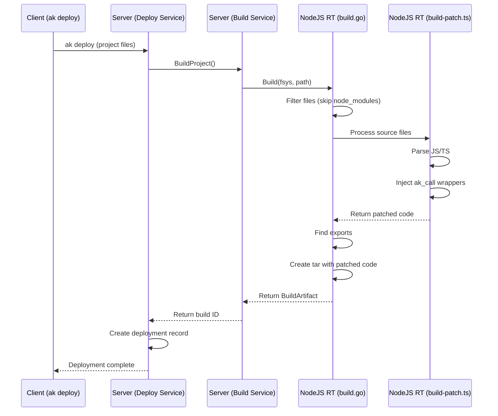

# NodeJS Runtime Build Flow

This diagram shows the build process flow for the NodeJS runtime, specifically the interaction between `build.go` and `build-patch.ts`:

## Components

- `build.go`: Handles the overall build process including file filtering, export discovery, and artifact creation
- `build-patch.ts`: Responsible for code transformation, specifically injecting `ak_call` wrappers around function calls