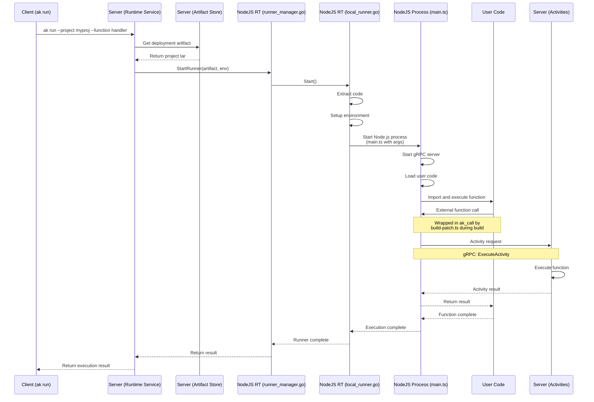

# NodeJS Runtime Run Flow

This diagram shows the runtime execution flow for the NodeJS runtime, detailing how `ak run` command executes code and handles activities through the Node.js runner:

## Components

- `Client (ak run)`: Command line interface for executing project functions
- `Server (Runtime Service)`: Manages execution sessions and coordinates with runners
- `Server (Artifact Store)`: Stores and provides access to deployment artifacts
- `NodeJS RT (runner_manager.go)`: Manages Node.js runner instances
- `NodeJS RT (local_runner.go)`: Handles local execution of Node.js code
- `NodeJS Process (main.ts)`: The actual Node.js runner process that executes code
- `User Code`: The deployed project code being executed
- `Server (Activities)`: Handles execution of external function calls

## Flow Description

1. **Execution Initiation**
   - User runs `ak run --project myproj --function handler`
   - Runtime service retrieves deployment artifact
   - Artifact is extracted to temporary directory

2. **Runner Setup**
   - Runner manager creates new runner instance
   - Local runner extracts code and sets up environment
   - `main.ts` is started with necessary arguments:
     - `--worker-address`: gRPC server address
     - `--port`: Runner's port
     - `--runner-id`: Unique runner ID
     - `--code-dir`: Path to extracted code

3. **Code Execution**
   - Node.js process loads and executes specified function
   - External function calls are intercepted by `ak_call` wrapper
   - Activities are executed through gRPC communication
   - Results are returned to user code

4. **Completion**
   - Function execution completes
   - Results are returned through the chain
   - Resources are cleaned up 