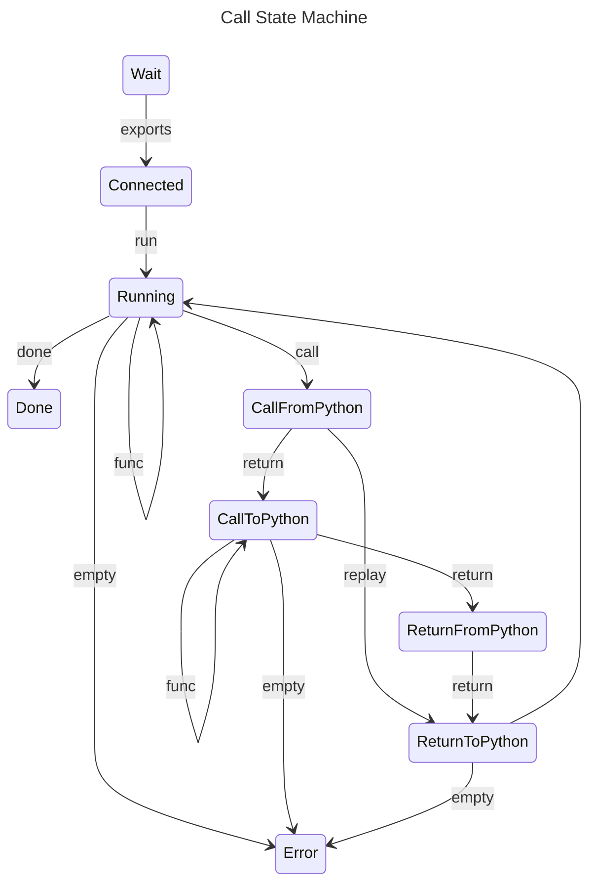

# Python Runtime

Implementation of Python runtime. 
See [Python runtime](https://linear.app/autokitteh/project/python-runtime-be87fe4c4d7d) for list of issues.

Currently, we don't support 3rd party packages (e.g. `pip install`) for the user code.
See [ENG-538](https://linear.app/autokitteh/issue/ENG-538/support-python-dependencies) for more details.
For a realistic POC/demo, we'll pre-install the packages the user code requires (e.g. `slack-sdk`).

## Python Handler Function

Python's handler functions should receive a single `dict` value which is the triggering event.
This event has the following keys:

- `event_type` (str): The event type
- `event_id` (str): The event ID
- `integration_id` (str): The ID of the integration that fired the event
- `data` (dict): The event payload (integration specific)

The return value from Python entry points is ignored and is not passed back to autokitteh.

### Limitations

You can't issue function calls at module level (e.g. `TOKEN = os.getenv('TOKEN')`)

Python serializes function calls using `pickle`, some callables can't be pickled:
- lambda
- dynamically generate functions (notably os.environ.get)

## Patching User Code

The Python code (`ak_runner.py`) loads the user code and patches every function call.
It does so by hooking into the regular import hook.
When the user module is loaded, we transform the AST to change function calls from:

```python
urlopen(url)
```

to:

```python 
_ak_call(urlopen, url)
```

`ak_call` will call the Go Python runtime which will start an activity.

### Detecting External Function Calls

When the user module is loaded, we set `MODULE_NAME` to the name of the loaded module.
When `ak_call` is invoked with a function it compares the function module name with `MODULE_NAME`,
if they are the same, it's an internal function and `ak_call` will return the invocation of the function.
Otherwise, `ak_call` will call the Go process that will invoke an activity.

See [ENG-495](https://linear.app/autokitteh/issue/ENG-495/better-detection-of-external-functions).

## Go ↔ Python Communication Flow

A run calls start a Python server with:
- Tar file containing user code
- Entry point (e.g. `review.py:on_github_pull_request`)

It will also inject `vars` definition from the manifest to the Python process environment.

The Python server returns a list of exported symbols from the user code.

### Communication Sequence

A call with function and payload:

```mermaid
sequenceDiagram
    Python-->>Go: Module loade
    Go-->Python Exports
    Go->>Python: Run(function, payload)
    loop
        Python-->>Go: Activity request (function name, args, payload)
        Go ->>Python: Activity call (payload, skipped in reply)
        Python-->>Go: Activity value (skipped in reply)
        Go ->>Python: Activity Value
    end
    Python-->>Go: Run return (None)
```

Other messages are:

- `log` from Python to Go
- `sleep` from Python to Go


### State Machine

Below is the state machine for `Call`:



### Communication Protocol

We're using gRPC, see the top level `proto` directory. Mostly `handler_svc.proto` and `runner_svc.proto`.


### Integration Testing

To make sure you use `autokitteh` from the `py-sdk`, update your `PYTHONPATH` before running `ak`.
Run the following from the root of the repo:
    
    export PYTHONPATH="${PWD}/runtimes/pythonrt/py-sdk:${PYTHONPATH}"

If you run `ak` with a database, then run `make create-workflow` once. 
Otherwise run it every time.
This will create a deployment for `testdata/simple/`

Then run `make run-workflow`.

### `ak` with database

Look for the `config.yaml` in `ak config where` directory. Then add the following

```yaml
db:
  dsn: /tmp/ak.db  # Pick any other location
  type: sqlite
```

## Hacking

The `ak_runner` is directory in `ak`, you'll need to build it (`make bin` from root of project) every time you change Python code and want to run workflows.

Your code should be formatted with `ruff`.
